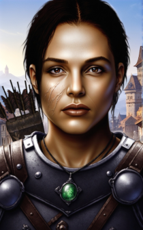

# Love Conquers All (LCA) Mod for Baldur's Gate Extended Edition Trilogy (EET)
 

This mod allows Corwin to be added to the party in Shadows of Amn, and Caelar to be added in Throne of Bhaal. Players can either continue the romance they started with Corwin in Siege of Dragonspear, or they can start a new romance with her after her arrival in Athkatla. The mod adds more than 200 new dialogs spread across the four games of the Bhaalspawn saga. Moreover, there are dozens of new items, quests, and cutscenes to enjoy. The <a href="User%20Guide.pdf" target="_blank">User Guide</a> includes instructions on how to add Corwin and Caelar to your party.   

If you have any questions, or would like to provide feedback, please contact me at <a href="mailto:LCAMod@danielvalle.net">LCAMod@danielvalle.net</a>. Alternatively, you can post any concerns to the <a href="https://www.gibberlings3.net/forums/topic/36832-announcing-love-conquers-all-lca-%E2%80%93-corwin-romance-mod-for-eet" target="_blank">Gibberlings3 forum post</a>.  

### Useful Links
<ul>
	<li><a href="https://github.com/LCA-EET/LCA/releases">Releases</a></li>
	<li><a href="https://github.com/LCA-EET/LCA/blob/main">Github Repository</a></li>
	<li><a href="https://www.gibberlings3.net/forums/topic/36832-announcing-love-conquers-all-lca-%E2%80%93-corwin-romance-mod-for-eet">Gibberlings3 Forum Post</a></li>
	<li><a href="https://forums.beamdog.com/discussion/87688/announcing-love-conquers-all-lca-corwin-romance-mod-for-eet">Beamdog Forums Post</a></li>
	<li><a href="https://www.youtube.com/channel/UCuD4dw9zg2sK9M1jwStkzSg">YouTube</a></li>
	
</ul>
	